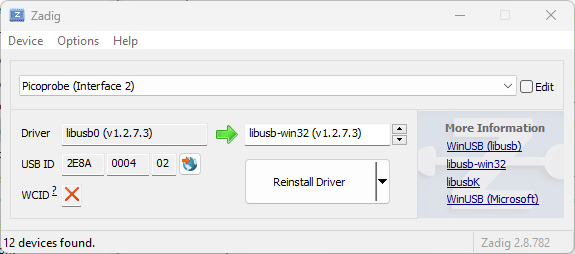
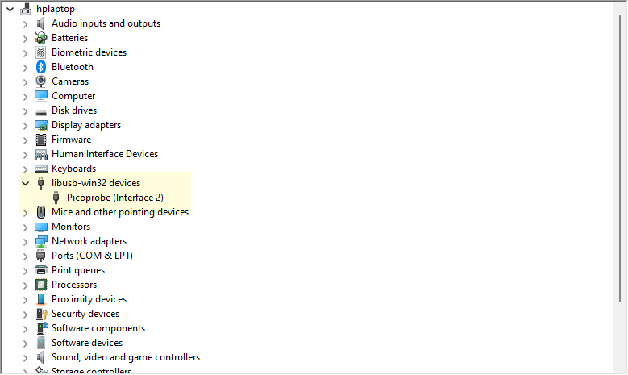
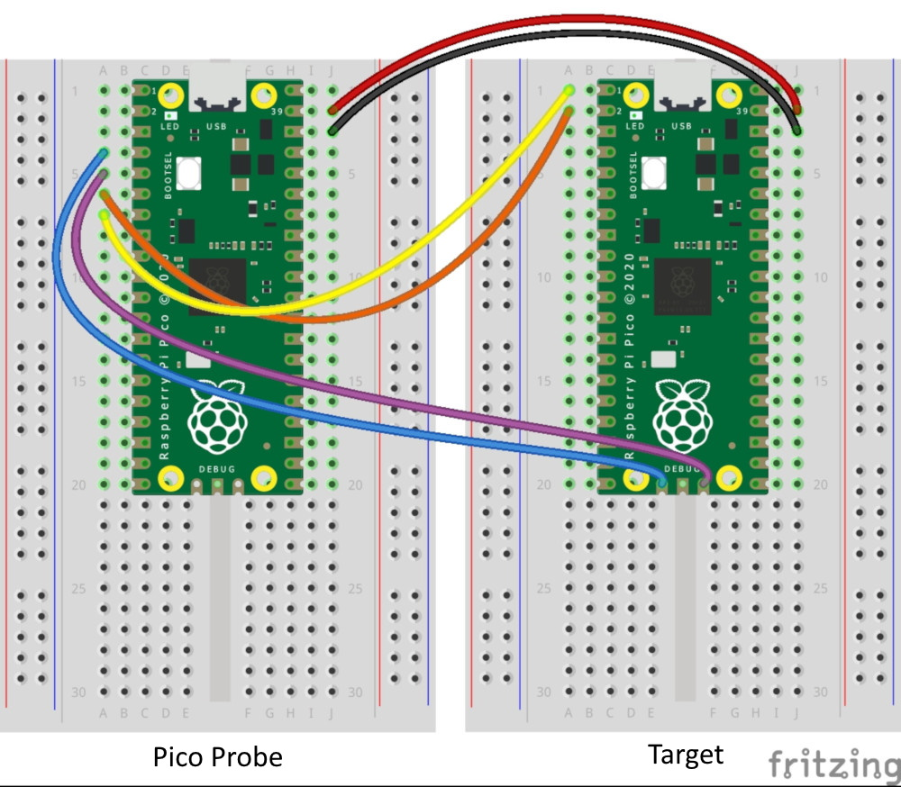
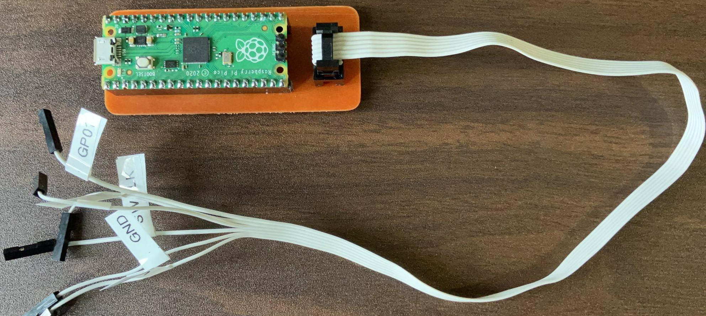
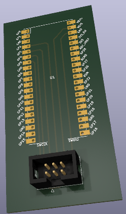
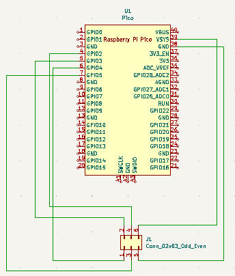

# Pico Probe 
Using the Raspberry Pi Pico as a SWD (Software Debug) Probe.  Simple schematic and PCB to easily setup a Raspberry Pi PICO and a Pico Probe

## platformio.ini settings 
```ini
[env:pico]
platform = raspberrypi
board = pico
framework = arduino
debug_tool = picoprobe
upload_protocol = picoprobe
;start debugging at sketch setup() otherwise start in RTOS main
debug_init_break = tbreak setup

```
Be sure to use zadig to replace the USB driver on **Picoprobe (Interface 2)** to **libusb-win32** (Windows)



Device Manager



### Connection Diagram 






